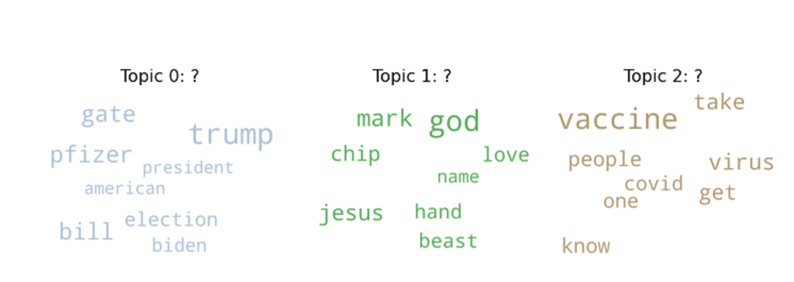

# What do people on YouTube think about a COVID-19 vaccine? Topic Modeling (LDA) on comments of popular and relevant YouTube videos

**Date: November 25th of  2020**

This study has been realized on a sample of **58532 comments** scraped from the most popular and relevant videos over the last **7 months** (since the beginning of the pandemic in the western world). The aim was to be able to identify tangible sentiments as it pertains to the **potential effectiveness**, the **receptiveness** or even the **feasability** of a COVID-19 Vaccine.  The channels hosting the videos are mainly from the US. American channels are viewed worldwide, so this work is not an opinion mining task that is exclusive to them.

## Data preprocessing and Latent Dirichlet Allocation algorithm training

The removal of relative stop words have mainly been done with the TF-IDF (Term Frequency - Inverse Document Frequency) algorithm. For a given document, words that had a score greater than the first quartile were kept and considered as relevant (75% of the distribution). Further processing was needed to get rid of general stop words, to remove special tokens such as emails or urls and to lemmatized the data.  

[image cohérence values]

Looking at the cohérence values, 3 is the optimal number of topics. The last topic (topic number 2) is the most discussed one.

[image most discussed topics]

We can see a clear separation between those three topics
[image topic contributions 2]

Saliency accounts for how truly informative a word is for determining a topic. Knowing the saliency of a term helps us evaluate those that profoundly characterize a topic. Saliency and relevancy are not synonymous : A word can be relevant in several topics but can only be salient in one. 

After reading the top 20 most representative documents(comments) for each topic:

Topic 0 (1% of all comments): New World Order, US Election and Bill Gates
The most salient word is « Trump » followed by « Pfizer », « Bill » and « gate ».
This topic is characterized by :
-	People saying post american election time will be the beginning of a new world order because Biden won.
-	The pandemic was planned by Bill Gates with Event 201
-	People affirming that Big pharma is not to be trusted since Pfizer claimed a 90% vaccine effectiveness but sold 60% of their stock afterwards.
 
 
Topic 1(2% of all comments): COVID-19 vaccine and the mark of the beast
The most salient word is « god », followed by  « mark », « jesus » and « chip ».
This topic is characterized by :
-	People telling others to not take the vaccine since it is the mark of the beast
-	People saying the vaccine will alter people’s dna
-	People saying Jesus is the way if people want to be saved

Topic 2 (97% of all comments): Vaccine skepticism
Without any surprise the most salient word is « vaccine ».
This topic is the most dominant and is most characterized by :
-	A reluctancy to take the vaccine especially because it is fast-paced.
-	People contending that the vaccine cannot stop the transmission of the virus.
-	Disapproval of genetic engineering (mRNA).
-	People not accepting a mandatory vaccine since it won’t affect others that willingly choose to be vaccinated.
-	People saying they are willing take it unless the vaccine is thoroughly tested.

